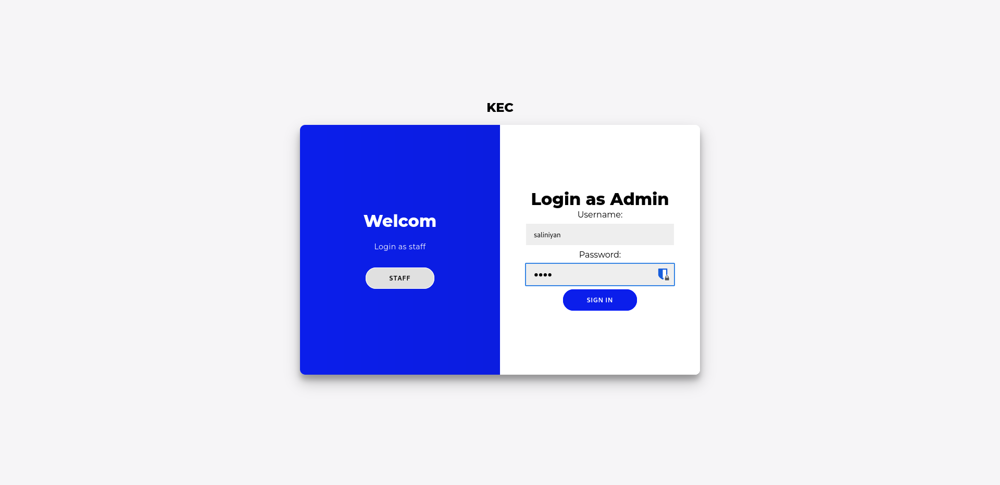

# Room Booking System
This project is a web-based room booking system built using Python, HTML, CSS, and Flask. The system allows users to book rooms for various purposes through a user-friendly interface. It also includes an admin panel for managing users and room bookings.

## Features

- **Admin Panel**: Admins can manage user accounts, rooms, and bookings.
- **Room Availability Check**: Users can check the availability of rooms before booking.
- `3D View of Rooms: Explore our rooms in detail with 3D views, helping you make informed booking decisions.`
- **Database Integration**: Uses MongoDB for storing user, room, and booking information.

  
## Screenshots

### Login Page

### Add Room

### View Room

### Add user

### User page After log in using name and password

### Booking Page

### Form Page

### Back to Admin Panel using Admin User and password

### View Accepted Bookings

## Hosted Application

You can access the hosted application at [Room Booking System](https://saliniyan.pythonanywhere.com/).

- **Regular User**: 
  - Create from Admin Page(for instance user :a, Password:a)
- **Admin User**:
  - Username: `b`
  - Password: `456`

## Installation

### Prerequisites

- Python 3.10
- Flask
- MongoDB

## Usage

1. Open your browser and navigate to `http://localhost:5000`.
2. Register for a new account or log in with an existing one.
3. To book a room, navigate to the booking page, select the desired room, date, and time, and confirm the booking.
4. Admin users can log in to access the admin panel where they can manage bookings.

